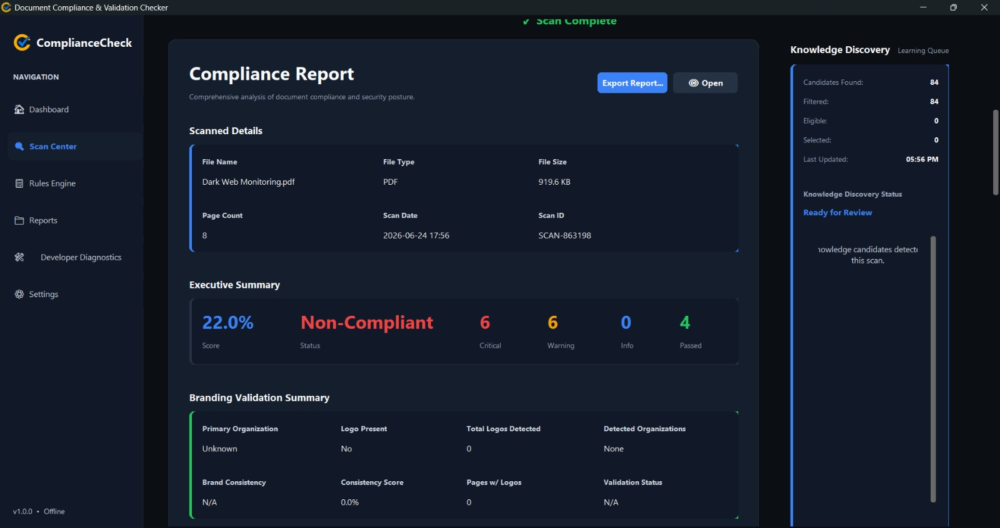

# Vel Tech Summer Internship 2026: Cyber Security & Compliance Automation


## 📌 Project Overview
This repository documents my 2026 Summer Internship at **Necurity Solutions Network Security Pvt. Ltd.** The internship focused on establishing a robust foundation in Cyber Security, Linux Administration, Vulnerability Analysis, and culminated in the development of a **Document Compliance & Validation Checker** application to automate security report reviews.

---

## 👨‍🎓 Internship Details
- **Name:** Pratik Das
- **College:** Vel Tech Rangarajan Dr. Sagunthala R&D Institute of Science and Technology
- **Department:** B.Tech Computer Science and Engineering (Cyber Security)

## 🏢 Organization
**Necurity Solutions Network Security Pvt. Ltd.**

---

## 🎯 Internship Objectives
- 🛡️ **Cyber Security Research:** Study and analyze modern attack vectors and defense mechanisms.
- 🐧 **Linux Administration:** Master command-line operations, file permissions, and network diagnostics.
- 🔍 **Vulnerability Analysis:** Identify and document outdated software components and their associated CVEs.
- 📄 **Security Reporting:** Review Web Application VAPT reports for quality assurance and compliance.
- ⚙️ **Automation Development:** Build a compliance validation tool to streamline the review of security documents.

---

## 💻 Technologies & Tools Used
- **Operating Systems:** Kali Linux, Ubuntu, Windows
- **Virtualization:** Oracle VirtualBox
- **Security Platforms:** TryHackMe, OverTheWire Bandit
- **Development & Automation:** Custom Document Compliance Checker

---

## 🚀 Development Progress: Document Compliance Checker

As part of streamlining the review of 22 VAPT reports, I developed a **Document Compliance & Validation Checker**. Below is the chronological evolution of the application:

### Stage 1: Initial Interface & Prototyping
The initial prototype focused on establishing the core UI structure, including a sidebar and empty dashboard placeholders for compliance scores and findings.


### Stage 2: Knowledge Base & Rules Engine Integration
Added the underlying rules engine capable of parsing thousands of dictionary words, cybersecurity terms, acronyms, and a vulnerability knowledge base. This provided the logical backbone for the compliance checks.


### Stage 3: Platform Dashboard & Analytics
Refined the UI branding ("ComplianceCheck") and implemented real-time metrics showing documents scanned, average match confidence, and a summary of critical issues.


### Stage 4: Comprehensive Reporting Engine
Developed the detailed report view allowing users to analyze specific documents (e.g., "Dark Web Monitoring.pdf"), displaying executive summaries, passed/failed validation checks, and branding consistency scores.



---

## 📅 Development Timeline

- **Week 1:** Virtual Lab Setup, Linux Fundamentals, Penetration Testing Basics (TryHackMe & OverTheWire).
- **Week 2:** Vulnerability Research, Security Report Review, and Automation Scripting for the Compliance Checker.
- **Week 3 & 4:** App Refinement, UI Improvements, Rules Engine Optimization, and Final Documentation (Consolidated in Week 2 progress logs).

---

## 📂 Folder Structure

```text
Vel Tech Summer Internship/
│
├── README.md                              # Main project documentation
├── .gitignore                             # Ignored files for Git
├── LICENSE                                # Project license
│
├── Week 1/                                # First week progress and tasks
│   └── Week1-Progress.md
│
├── Week 2/                                # Second week progress and tasks
│   ├── Week2-Progress.md
│   └── Vulnerability-Research-Summary.md
│
└── Screenshots/                           # Image assets and progress evidence
    ├── 01_Initial_Interface.jpeg
    ├── 02_Rules_Engine.jpeg
    ├── 03_Platform_Dashboard.jpeg
    ├── 04_Compliance_Report.jpeg
    └── [Additional lab screenshots]
```

---

## 🏆 Key Deliverables
1. **Virtual Lab Environment:** Fully functional Kali and Ubuntu VMs.
2. **Security Documentation:** 4-sheet Excel workbook mapping CVEs to outdated software components.
3. **Quality Assurance:** 22 reviewed and modified Web Application VAPT reports.
4. **Compliance Checker App:** A working platform for automating document compliance and validation.

---

## 🧗 Challenges Faced
- **Information Overload:** Navigating the vast amount of CVE data and mapping them accurately to software versions.
- **Confidentiality Restrictions:** Learning how to effectively document progress and findings without exposing sensitive organizational data or client IPs.
- **UI/UX Consistency:** Iterating on the Compliance Checker application to ensure a professional, intuitive user experience while handling complex data.

---

## 🧠 Learning Outcomes
- Acquired hands-on experience with **Linux command-line** tools and **OSINT** investigations.
- Gained a deep understanding of **Vulnerability Management workflows** and the **CVSS scoring** system.
- Learned the importance of **meticulous security reporting** and how automation can reduce human error in compliance checks.

---

## ✨ Final Outcome
This internship successfully bridged the gap between theoretical cybersecurity concepts and practical, enterprise-level application. The creation of the Document Compliance Checker demonstrates not only an understanding of security vulnerabilities but also the ability to build solutions that improve organizational efficiency.

---

## 🙏 Acknowledgements
A special thanks to the mentors and the team at **Necurity Solutions Network Security Pvt. Ltd.** for their guidance, support, and the opportunity to contribute to real-world security projects.

---
*Maintained as part of the Vel Tech Summer Internship Program (2026).*
