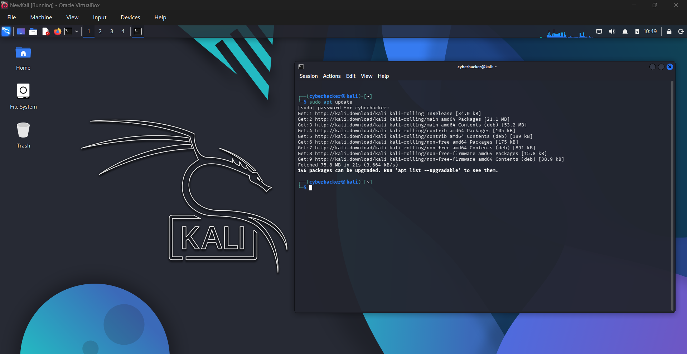
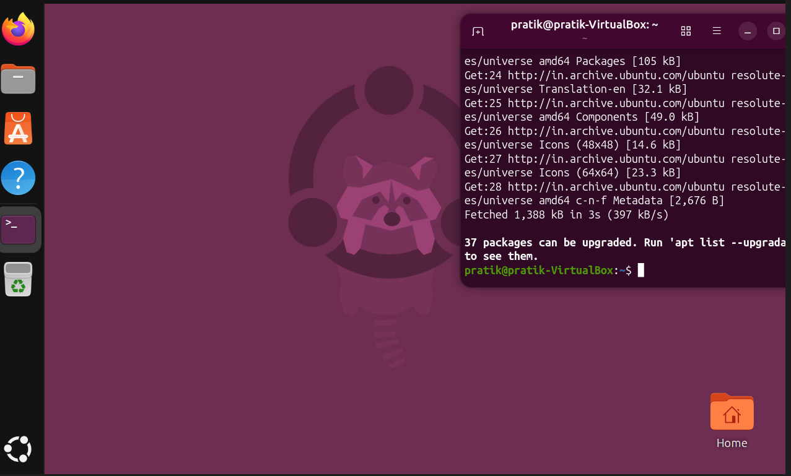
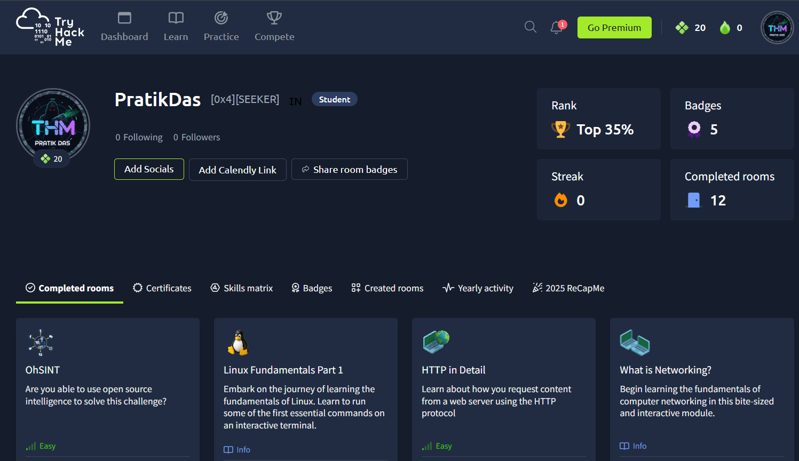
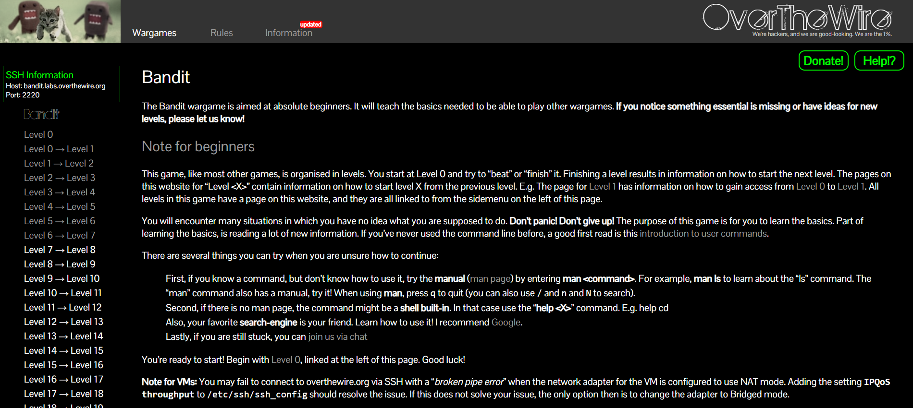

# Week 1: Foundation & Environment Setup

## Objectives
- Establish a functional cybersecurity lab environment.
- Develop proficiency in foundational Linux command-line operations.
- Gain an introductory understanding of penetration testing methodologies, networking, and OSINT.

## Activities
1. **Virtual Lab Setup**: Installed Oracle VirtualBox and configured Kali Linux and Ubuntu Linux virtual machines as isolated testing environments.
2. **Linux Administration Practice**: Practiced essential commands for directory navigation, file management, permissions, and network diagnostics (`ls`, `chmod`, `netstat`, etc.).
3. **TryHackMe Modules**: Completed foundational training modules including OhSINT, Linux Fundamentals, HTTP/DNS in Detail, and Web Application Basics.
4. **OverTheWire Bandit Wargame**: Completed Levels 0 through 6, focusing on SSH connectivity and hidden file enumeration.

## Learning
- Navigating and managing Linux file systems securely.
- Understanding core networking protocols (HTTP, DNS) and their role in web application security.
- Recognizing the phases of a penetration test (Reconnaissance, Scanning, Enumeration, Exploitation, Reporting).

## Technologies Used
- Oracle VirtualBox, Kali Linux, Ubuntu Linux, TryHackMe, OverTheWire.

## Challenges
- Adapting to command-line-only environments for file manipulation.
- Understanding the nuances between different Linux distributions.

## Key Outcomes
- Successfully deployed a complete virtual offensive and defensive lab.
- Built a strong baseline in terminal usage, setting up the required foundation for the remainder of the internship.

## Screenshots
### Kali Linux Setup

### Ubuntu Linux Setup

### TryHackMe Progress

### OverTheWire Bandit Progress

