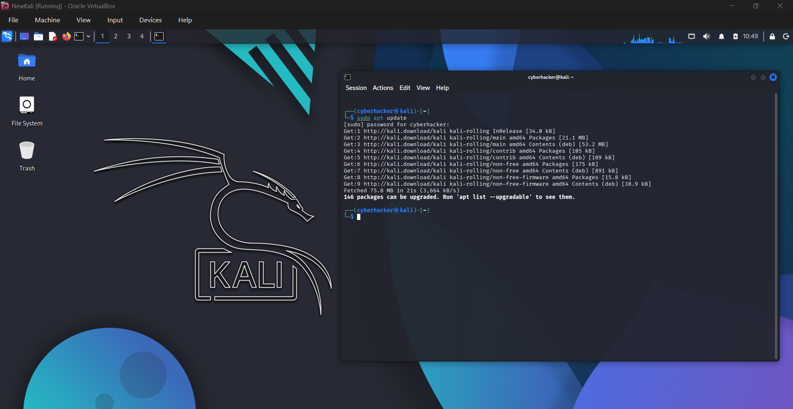
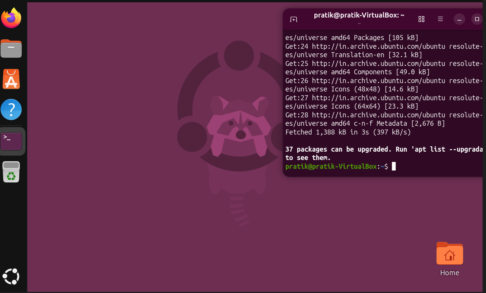
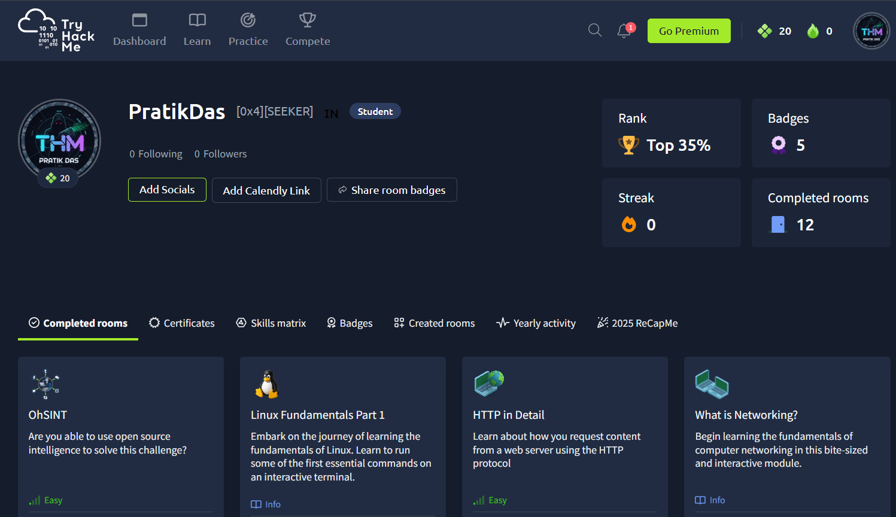
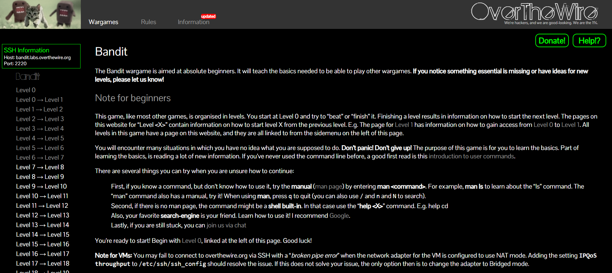

# Week 1 Progress Report

## Internship Overview

The first week of the internship focused on building a strong foundation in Cyber Security through virtual lab setup, Linux fundamentals, networking concepts, web technologies, OSINT, and introductory penetration testing. Practical learning was conducted through TryHackMe rooms and hands-on Linux usage in virtual machines.

---

# Virtual Lab Setup

## Oracle VirtualBox Installation

Installed Oracle VirtualBox to create isolated environments for cybersecurity learning and testing.

### Purpose

* Run multiple operating systems on a single machine
* Create safe environments for security testing
* Learn cybersecurity tools without affecting the host system

---

## Kali Linux Installation

Installed Kali Linux in VirtualBox.

### Topics Explored

* Linux terminal usage
* Cybersecurity-focused operating system
* Security testing environment
* Penetration testing tools

### Tools Observed

* Nmap
* Burp Suite
* Metasploit Framework
* Wireshark

### Learning Outcome

Understood the importance of Kali Linux as a platform for security assessments and ethical hacking.

---

## Ubuntu Linux Installation

Installed Ubuntu Linux in VirtualBox.

### Topics Explored

* Linux operating system basics
* User management
* File system structure
* Terminal commands

### Learning Outcome

Developed familiarity with Linux environments commonly used in servers and enterprise systems.

---

# Linux Commands Learned

## pwd

```bash
pwd
```

Displays the current working directory.

---

## ls

```bash
ls
```

Lists files and directories in the current location.

---

## cd

```bash
cd directory_name
```

Changes the current directory.

---

## mkdir

```bash
mkdir folder_name
```

Creates a new directory.

---

## rmdir

```bash
rmdir folder_name
```

Removes an empty directory.

---

## rm

```bash
rm file_name
```

Deletes files.

---

## cp

```bash
cp source destination
```

Copies files and directories.

---

## mv

```bash
mv old_name new_name
```

Moves or renames files and directories.

---

## cat

```bash
cat file.txt
```

Displays the contents of a file.

---

## grep

```bash
grep keyword file.txt
```

Searches for specific patterns within files.

---

## find

```bash
find /path -name filename
```

Searches for files and directories.

---

## chmod

```bash
chmod 755 file.sh
```

Changes file permissions.

---

## chown

```bash
chown user:user file.txt
```

Changes file ownership.

---

## ping

```bash
ping google.com
```

Tests network connectivity and reachability.

---

## ifconfig

```bash
ifconfig
```

Displays network interface configuration information.

---

## ip addr

```bash
ip addr
```

Displays IP address and network interface details.

---

## netstat

```bash
netstat -an
```

Displays active network connections and listening ports.

---

# TryHackMe Rooms Completed

## 1. OhSINT

### Objective

Learn the fundamentals of Open Source Intelligence (OSINT).

### Topics Covered

* Social media investigation
* Public information gathering
* Metadata analysis
* Digital footprint tracking

### Skills Learned

* Investigating usernames across platforms
* Gathering information from publicly available sources
* Identifying digital traces left by users online

### Key Takeaway

Publicly available information can reveal significant details about individuals and organizations.

---

## 2. Linux Fundamentals Part 1

### Objective

Learn the basics of Linux and terminal navigation.

### Topics Covered

* Linux file system
* Directory navigation
* File management
* Basic terminal commands

### Skills Learned

* Navigating directories
* Creating and deleting files and folders
* Managing Linux resources through the command line

### Key Takeaway

Linux command-line proficiency is a fundamental skill for cybersecurity professionals.

---

## 3. HTTP in Detail

### Objective

Understand how web browsers communicate with web servers.

### Topics Covered

* HTTP protocol
* Client-server architecture
* Requests and responses
* HTTP methods

### HTTP Methods Learned

* GET
* POST
* PUT
* DELETE

### Skills Learned

* Understanding web traffic
* Analyzing requests and responses
* Learning the structure of web communication

### Key Takeaway

Most web application security testing involves analyzing HTTP requests and responses.

---

## 4. What is Networking?

### Objective

Learn the fundamentals of computer networking.

### Topics Covered

* Network devices
* IP addressing
* Data transmission
* Routers and switches

### Skills Learned

* Understanding how devices communicate
* Learning the role of networking hardware
* Understanding packet-based communication

### Key Takeaway

Networking forms the foundation of cybersecurity and penetration testing.

---

## 5. Pentesting Fundamentals

### Objective

Understand the ethical and technical foundations of penetration testing.

### Topics Covered

* Ethical hacking
* Vulnerability assessment
* Security testing methodology

### Penetration Testing Phases

1. Reconnaissance
2. Scanning
3. Enumeration
4. Exploitation
5. Reporting

### Key Takeaway

Penetration testing follows a structured and authorized methodology to identify security weaknesses.

---

## 6. Offensive Security Intro

### Objective

Understand the role of offensive security professionals.

### Topics Covered

* Ethical hacking
* Vulnerability discovery
* Exploitation concepts

### Skills Learned

* Identifying weaknesses in systems
* Understanding attacker methodologies

### Key Takeaway

Offensive security helps organizations discover vulnerabilities before attackers do.

---

## 7. Defensive Security Intro

### Objective

Learn how organizations defend against cyber threats.

### Topics Covered

* Security monitoring
* Threat detection
* Incident response
* Security operations

### Skills Learned

* Understanding blue-team operations
* Recognizing security monitoring processes

### Key Takeaway

Defensive security focuses on preventing, detecting, and responding to attacks.

---

## 8. Web Application Basics

### Objective

Learn the foundations of modern web applications.

### Topics Covered

* URLs
* HTTP methods
* Response codes
* Headers
* Web architecture

### Important Status Codes Learned

| Code | Meaning               |
| ---- | --------------------- |
| 200  | Success               |
| 301  | Redirect              |
| 403  | Forbidden             |
| 404  | Not Found             |
| 500  | Internal Server Error |

### Key Takeaway

Understanding web technologies is essential for web application security testing.

---

## 9. Guided Pentest: Web

### Objective

Understand the workflow of a web application penetration test.

### Topics Covered

* Web reconnaissance
* Enumeration
* Vulnerability identification
* Security assessment process

### Skills Learned

* Understanding attack methodology
* Information gathering techniques
* Structured security testing

### Key Takeaway

Effective penetration testing requires a systematic approach from reconnaissance to reporting.

---

## 10. DNS in Detail

### Objective

Understand how domain names are translated into IP addresses.

### Topics Covered

* DNS architecture
* Name resolution
* DNS records

### DNS Records Learned

| Record Type | Purpose                 |
| ----------- | ----------------------- |
| A           | IPv4 Address Mapping    |
| AAAA        | IPv6 Address Mapping    |
| MX          | Mail Server Information |
| NS          | Name Server Information |
| CNAME       | Alias Record            |

### Key Takeaway

DNS is a critical internet service and often plays a significant role in reconnaissance activities.

---

# Week 1 Outcome

By the end of Week 1, I successfully:

* Set up a complete cybersecurity lab environment using VirtualBox.
* Installed and configured Kali Linux and Ubuntu Linux.
* Learned essential Linux command-line operations.
* Developed an understanding of networking fundamentals.
* Studied HTTP and DNS protocols in detail.
* Learned the basics of offensive and defensive security.
* Completed multiple TryHackMe rooms focused on cybersecurity fundamentals.
* Gained foundational knowledge in penetration testing methodologies.
* Improved practical cybersecurity research and analytical skills.

## Skills Acquired

* Linux Fundamentals
* Networking Basics
* OSINT Techniques
* HTTP Protocol Analysis
* DNS Fundamentals
* Penetration Testing Concepts
* Offensive Security Basics
* Defensive Security Basics
* Web Application Fundamentals
* Cybersecurity Research Methodology

---

## 11. OverTheWire: Bandit (Levels 0–6)

### Objective
Learn Linux fundamentals and command-line navigation through practical challenges.

### Platform
OverTheWire – Bandit Wargame

### Levels Completed
- Bandit Level 0 → Level 1
- Bandit Level 1 → Level 2
- Bandit Level 2 → Level 3
- Bandit Level 3 → Level 4
- Bandit Level 4 → Level 5
- Bandit Level 5 → Level 6

### Topics Covered

#### SSH Access
Used SSH to connect to remote Linux systems.

```bash
ssh bandit0@bandit.labs.overthewire.org -p 2220
```

**Purpose:**
Securely access remote Linux machines through the command line.

---

#### File and Directory Navigation

Commands Practiced:

```bash
pwd
ls
ls -la
cd
```

**Learned:**
- Current working directory identification
- Hidden files and directories
- Navigating Linux file systems

---

#### Reading File Contents

Commands Practiced:

```bash
cat
less
more
```

**Learned:**
- Viewing text files
- Reading passwords stored in files
- Understanding file contents efficiently

---

#### Handling Special File Names

Commands Practiced:

```bash
cat ./-
cat "spaces in this filename"
```

**Learned:**
- Accessing files with unusual names
- Using quotes and relative paths

---

#### Hidden Files

Commands Practiced:

```bash
ls -a
```

**Learned:**
- Viewing hidden files
- Understanding Linux hidden file conventions

---

#### File Identification

Commands Practiced:

```bash
file filename
```

**Learned:**
- Determining file types
- Identifying human-readable files

---

#### Searching for Files

Commands Practiced:

```bash
find
```

Example:

```bash
find . -type f -size 1033c
```

**Learned:**
- Locating files based on size
- Finding files using different attributes

---

#### Human-Readable Files

Commands Practiced:

```bash
file
cat
```

**Learned:**
- Distinguishing text files from binary files
- Extracting information from readable files

---

### Skills Developed

- Linux command-line navigation
- SSH connectivity
- File discovery techniques
- Hidden file enumeration
- File type identification
- Reading and analyzing file contents
- Problem-solving in Linux environments

### Key Takeaway

The OverTheWire Bandit challenges provided hands-on experience with Linux commands and file system navigation. These exercises strengthened foundational skills that are essential for cybersecurity, penetration testing, system administration, and digital forensics.

---

# Evidence of Work

## Kali Linux Virtual Machine



---

## Ubuntu Linux Virtual Machine



---

## TryHackMe Progress



---

## OverTheWire Bandit Progress

