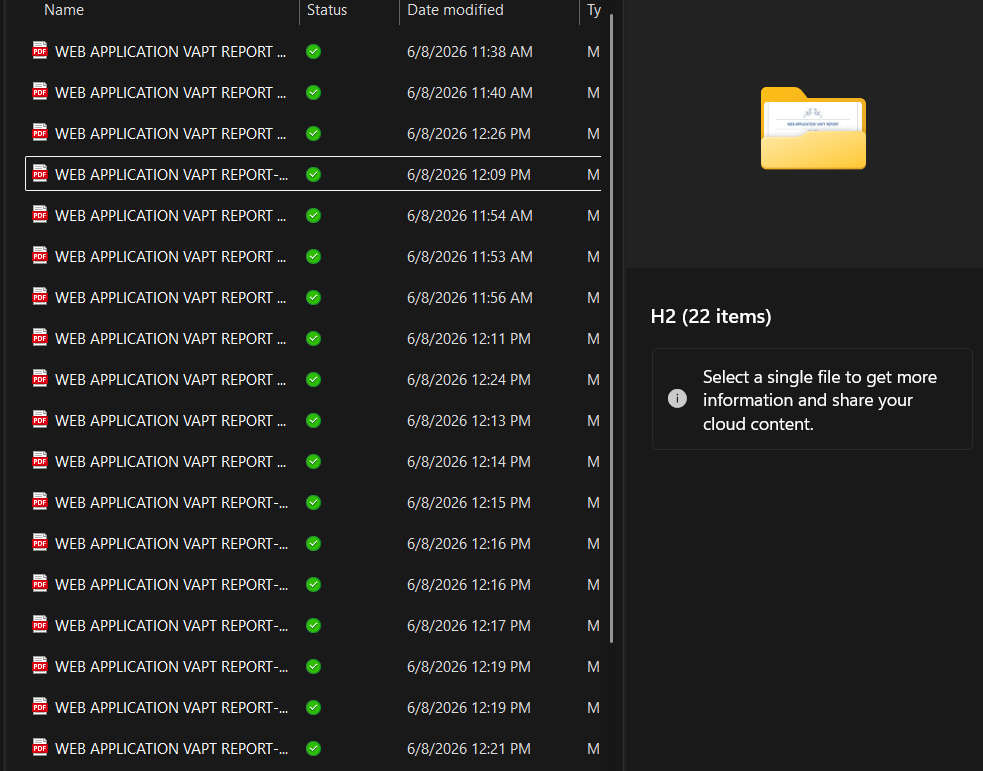

# VAPT Report Analysis

## Manual Quality Assurance
During this phase, I was tasked with reviewing 22 Web Application Vulnerability Assessment and Penetration Testing (VAPT) reports.

## Objectives
* **Standardization**: Ensuring all reports adhered to the strict organizational formatting guidelines.
* **Verification**: Cross-referencing technical findings to ensure they were accurately described and paired with correct severity metrics.
* **Consistency Check**: Identifying discrepancies in terminology, spelling errors, and missing evidence (screenshots) in analyst submissions.

## Key Outcome
This manual review process highlighted how time-consuming and error-prone human QA can be, establishing the direct motivation for the automated Compliance Checking Application developed later in the internship.

## Screenshots
*(Note: Actual report contents are omitted due to strict organizational confidentiality)*

