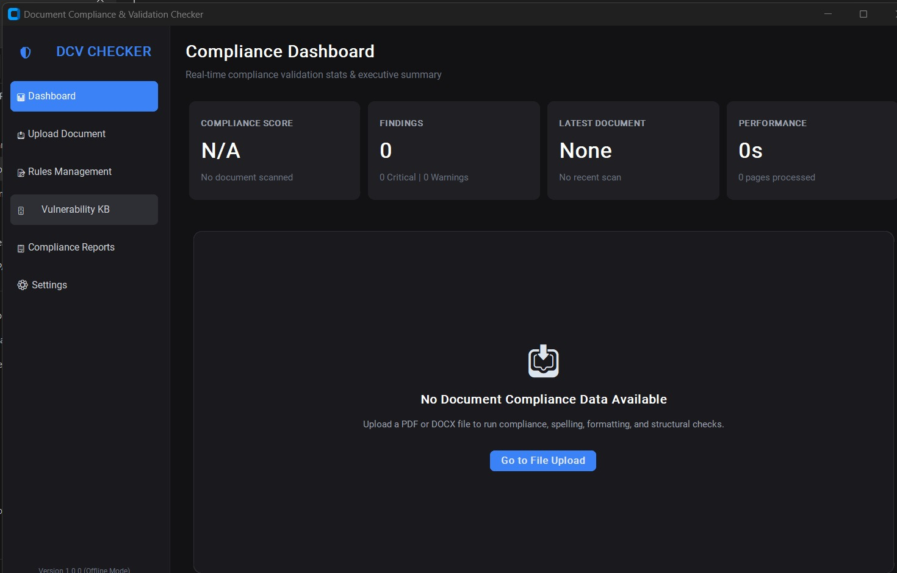
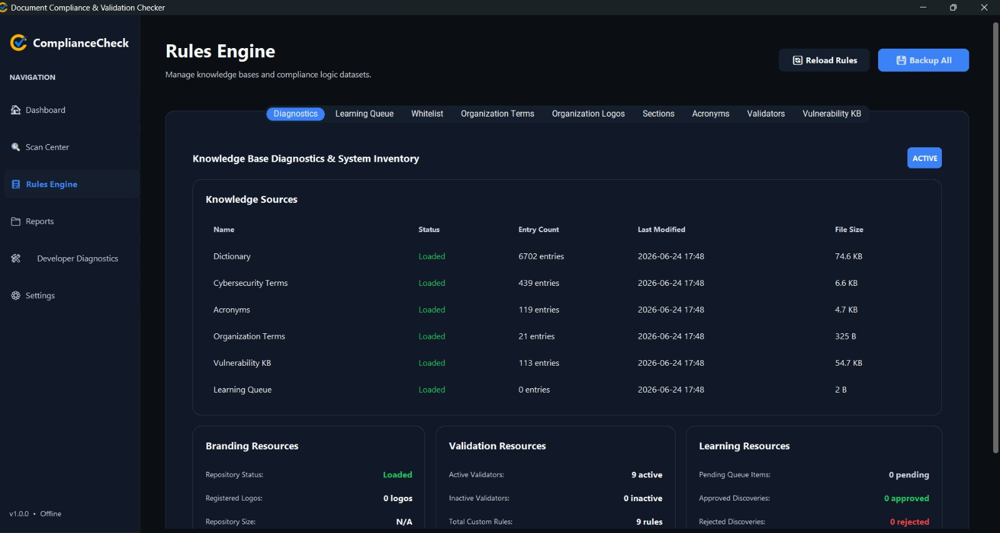

# Progress Update (Week 3)

## Transition to Development
This week marked the shift from vulnerability research to active software development. The realization that manual report review was unsustainable led to the approval to prototype an automated solution.

## Key Milestones Achieved
1. **Architecture Planning**: Established the core separation between the frontend dashboard and the backend validation engine.
2. **Knowledge Base Structuring**: Converted raw dictionary files and acronym lists into structured JSON formats, optimizing them for rapid in-memory lookups.
3. **Initial Prototyping**: Developed the first barebones CustomTkinter UI to test file uploading and basic text parsing using PyMuPDF.

## Screenshots
### Initial Interface Prototype

### Rules Engine Integration

