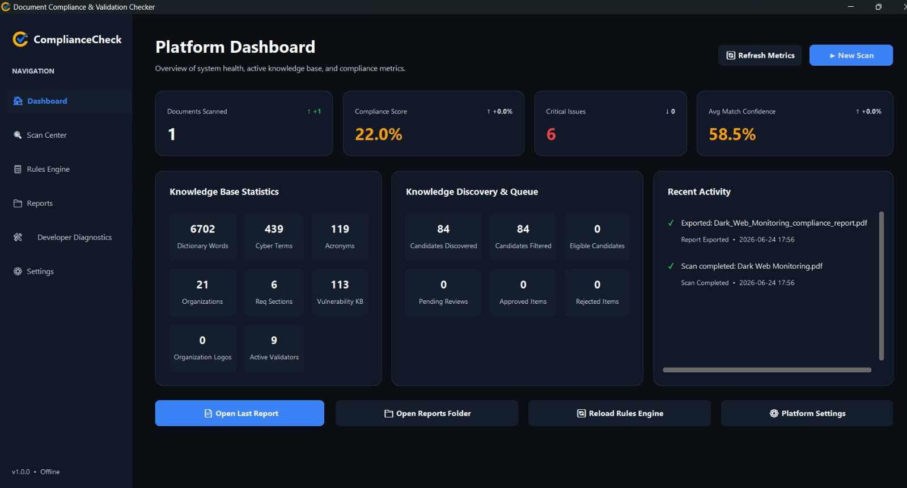

# Final Progress Update (Week 5)

## The Final Polish
During the last three days of the internship, the focus was entirely on output generation and DevOps packaging.

## Milestones Achieved
1. **Compliance Reporting Engine**: Finalized the `report_exporter.py` module using ReportLab. This allowed the application to generate a programmatic, highly-detailed PDF Compliance Report summarizing the findings (Critical, Warning, Info, Passed) of a document scan.
2. **Standalone Packaging**: Successfully navigated the complexities of PyInstaller. I configured a custom `.spec` file to bundle the Python environment, C-binaries (OpenCV, PyMuPDF), GUI themes, and JSON knowledge bases into a single, portable Windows executable (`.exe`).

## Screenshots
### Platform Dashboard

### Compliance Report Generation

