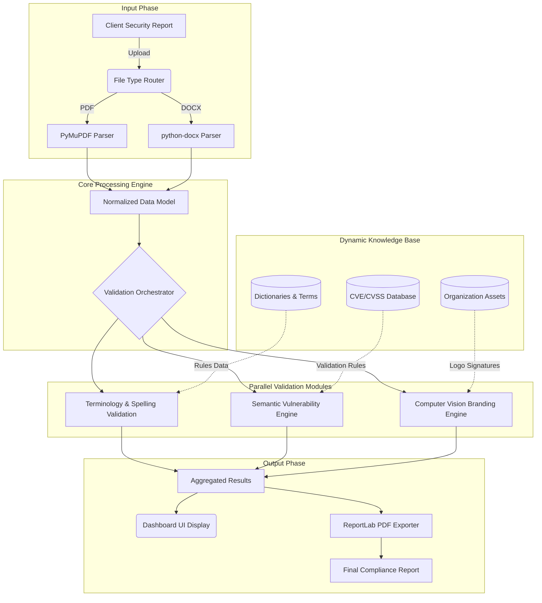

# System Architecture

The Compliance Checking Application follows a modular, pipelined architecture designed to process disparate document formats, run them through parallel validation algorithms, and generate a unified compliance report.

## High-Level Data Flow

The following diagram illustrates a generalized workflow of a document entering the system, passing through the core processing engines, and resulting in an exported PDF report.

## Architectural Components

1. **Input Layer (Parsers)**: Abstracts the differences between coordinate-based PDFs and XML-based DOCX files, extracting raw text, metadata, and embedded images.
2. **Core Processing Engine**: Normalizes the extracted data into a unified object model, readying it for the validation modules.
3. **Parallel Validation Modules**: Independent modules focusing on linguistics, semantic context matching (for CVEs), and computer vision (for branding checks).
4. **Dynamic Knowledge Base**: JSON-driven, local data stores that feed the validation engines. Unknown terms encountered during processing are sent to a Learning Queue for future inclusion.
5. **Output Phase**: Scan results are fed back to the CustomTkinter GUI asynchronously to ensure UI responsiveness, and a detailed PDF report is exported for auditing purposes.
